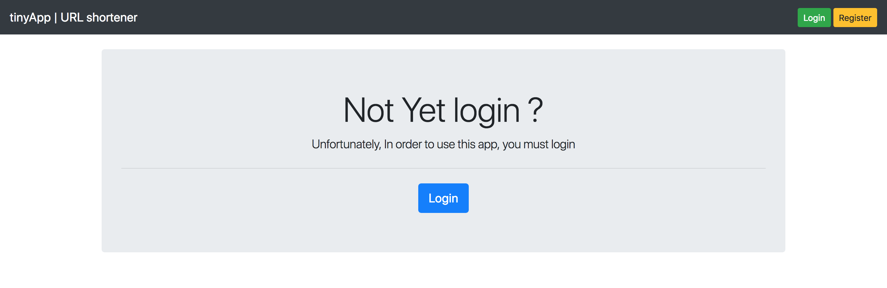
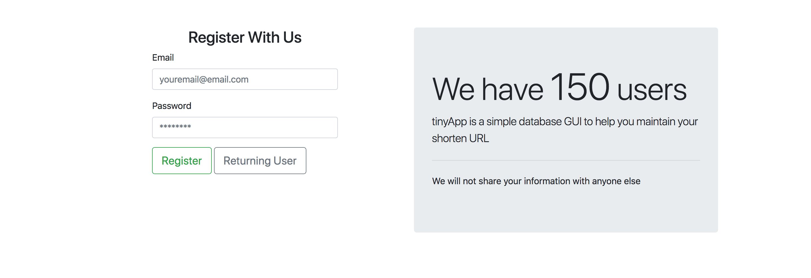
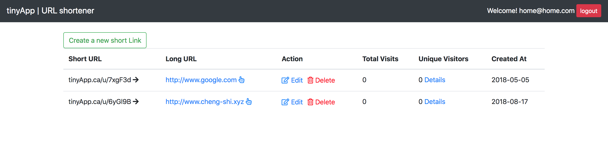
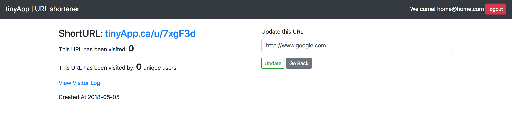

# TinyApp
This is a full-stack web application built on NodeJS with Express framework. TinyApp allows user to create, read, update and delete their own short URL and share with the publics. User password and hashed so user's info is highly protected

## Final Porject Demo
For testing purpose, this app has a build-in account
  - Email: home@home.com
  - Password: home
Please take an advantage of this 'fake' account for a quick experience







## Dependencies
* "bcrypt": "^3.0.0",
* "body-parser": "^1.18.3",
* "cookie-parser": "^1.4.3",
* "cookie-session": "^2.0.0-beta.3",
* "ejs": "^2.6.1",
* "express": "^4.16.3",
* "express-timestamp": "^0.1.4",
* "method-override": "^3.0.0"

## Get Started
* Clone this repository, make sure your have node and npm install
* Install all dependencies on your local machine from command line
```
npm install
```
* Run in development environment from command line
```
node express_server.js
```
* Register a new user and getting started !
